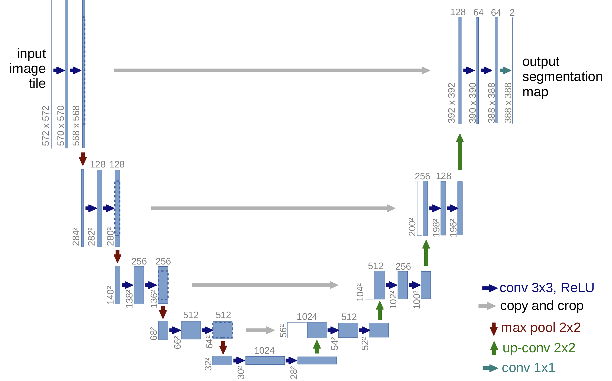

# Carvana-UNet-Implementation

> A learning-oriented U-Net implementation for Carvana Image Masking Challenge.

参照 `./reference/u-net-pytorch.ipynb` 实现的一个学习项目，基于 PyTorch 复现并理解 U-Net，用于 Carvana Image Masking Challenge 车辆分割任务。



## 学习目标 / Learning Objectives

- 熟悉语义分割任务及二值掩膜的处理流程；
- 手写实现一个带 BatchNorm 的 U-Net 编解码结构；
- 了解数据增强（Albumentations）在分割任务中的使用；
- 搭建端到端训练 / 验证循环并观察 loss 收敛情况；


## 环境依赖 / Requirements

- Python 3.8+
- PyTorch
- torchvision
- albumentations
- numpy
- opencv-python
- Jupyter / JupyterLab（运行示例 notebook 时需要）

可以使用 `pip` 手动安装依赖，例如：

```bash
pip install torch torchvision albumentations numpy opencv-python jupyter
```

## 数据集 / Dataset

- 比赛名称：Carvana Image Masking Challenge（Kaggle）
- 数据内容：车辆 RGB 图像及对应的二值分割掩膜
- 获取方式：从 Kaggle 下载数据集并解压

参考 notebook 中假设数据存放在相对路径（如 `./train`、`./train_masks` 等）下，请按自己的目录结构适当修改路径。

## 项目结构 / Project Structure

- `model.py`：U-Net 模型结构实现
- `dataset.py`：Carvana 数据集读取与数据增强
- `reference/u-net-pytorch.ipynb`：参考 notebook，用于训练与验证
- `U-Net.png`：U-Net 结构示意图
- `README.md`：项目说明
- `LICENSE`：开源许可证（Apache 2.0）

## 快速开始 / Quick Start

1. 克隆项目：

   ```bash
   git clone https://github.com/your-name/Carvana-UNet-Implementation.git
   cd Carvana-UNet-Implementation
   ```

2. 安装依赖（建议在虚拟环境中）：

   ```bash
   # 如果之后补充了 requirements.txt 文件，可以直接：
   pip install -r requirements.txt

   # 或者手动安装上面列出的依赖
   ```

3. 准备数据集：

- 从 Kaggle 下载 Carvana Image Masking Challenge 数据集；
- 解压训练图片与掩膜到本项目目录下，例如 `./train` 与 `./train_masks`；
- 在 notebook 或你自己的训练脚本中，确认数据路径与实际目录一致。

4. 训练模型（通过 notebook）：

   - 启动 Jupyter：

     ```bash
     jupyter notebook
     ```

   - 打开 `reference/u-net-pytorch.ipynb`，依次执行各个单元即可开始训练与验证。

你也可以参考 `model.py` 和 `dataset.py` 中的实现，将模型和数据集类集成到自己的训练脚本中。

## 实验与结果 / Experiments & Results

> 注：这里可以根据你自己的实验逐步补充，展示你学习和调参的过程。

- 训练配置示例：
  - 图像尺寸：`572 x 572`
  - 批大小（batch size）：`4`
  - 学习率（learning rate）：`1e-4`
  - 优化器：Adam
  - 损失函数：如 `BCEWithLogitsLoss` 或 `BCE + Dice` 组合
- 你可以在这里记录：
  - 不同 epoch 的 Train / Val Loss 变化；
  - 简单的 IoU / Dice 指标；
  - 一些预测可视化结果（原图 / mask / 预测）。

这样可以让别人很直观地看到你是如何一步一步调好一个分割模型的。

## 后续计划 / Roadmap

为了体现这是一个持续学习的仓库，可以列出你打算尝试的方向，例如：

- [ ] 使用预训练 ResNet 作为编码器（ResUNet）；
- [ ] 在 skip connection 中加入注意力模块（Attention U-Net）；
- [ ] 尝试不同损失函数（Dice / Focal / BCE + Dice）并比较效果；
- [ ] 加入更多数据增强策略，观察对泛化的影响；
- [ ] 整理一份中英双语的博客或笔记链接，介绍你的实现细节和踩坑经验。

## 参考 / References

- Kaggle: Carvana Image Masking Challenge
- Ronneberger et al., "U-Net: Convolutional Networks for Biomedical Image Segmentation"

## 许可协议 / License

本项目采用 Apache License 2.0 许可证，详情见 [LICENSE](./LICENSE)。
